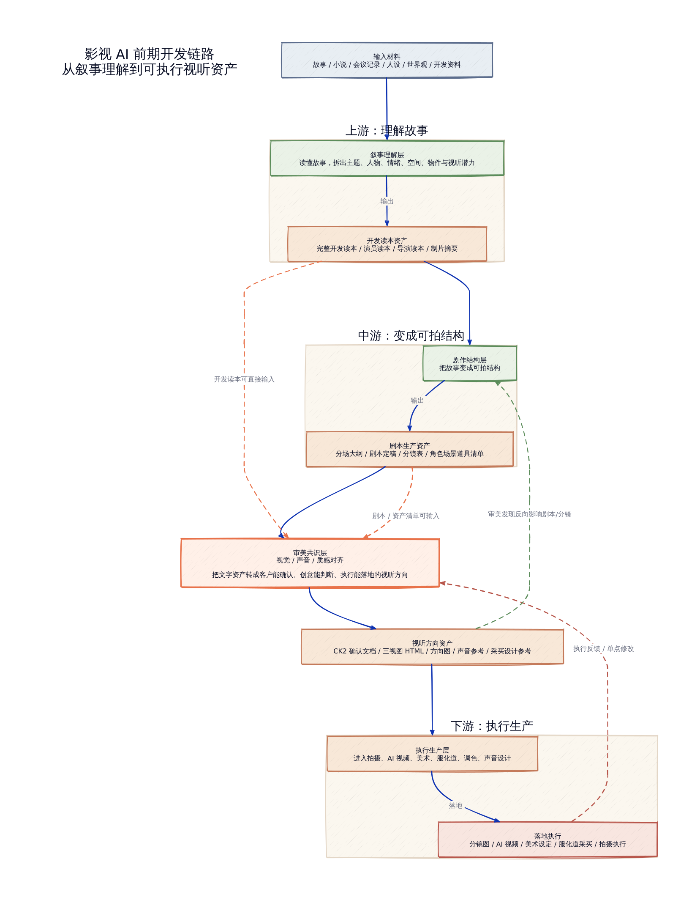
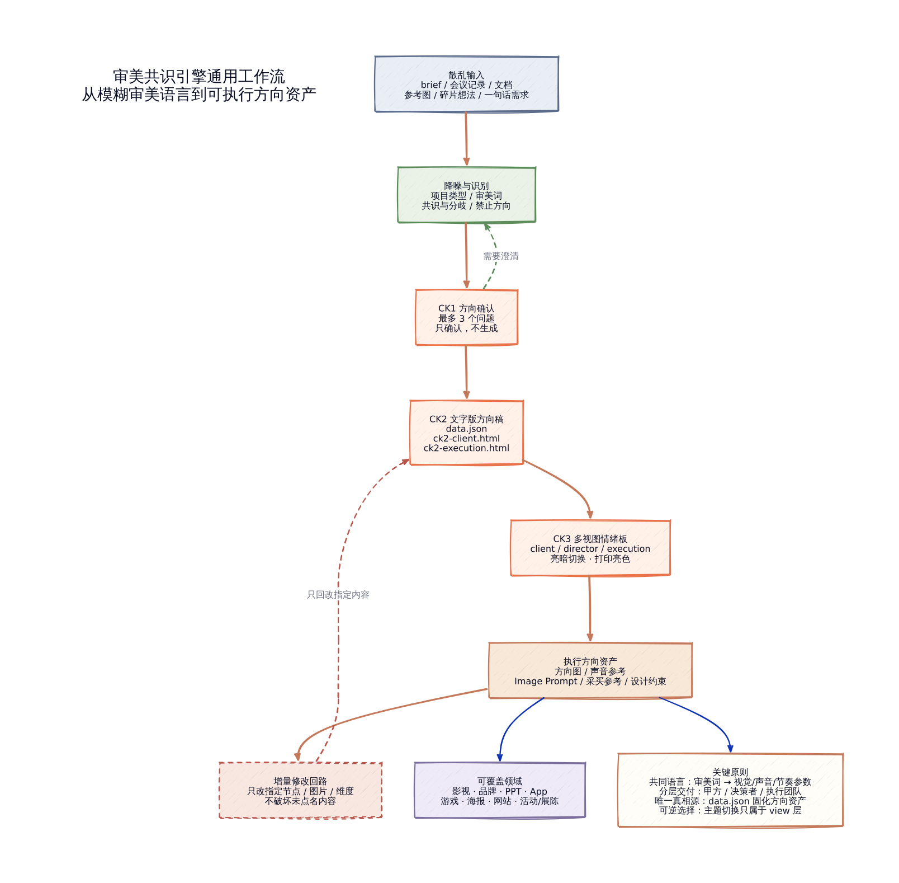

# Moodboard Alignment / 审美共识引擎

> **Moodboard Alignment turns fuzzy aesthetic briefs into confirmable, executable, and incrementally editable HTML moodboards.**  
> 审美共识引擎把 brief、会议记录、剧本读本、品牌文档、PPT 主题、App/游戏设定中的模糊审美描述，转化为可确认、可执行、可增量修改的 HTML 情绪板。

它不是一个单纯的「生成漂亮图片」工具，而是一个面向 **客户 / 创意 / 执行团队** 的审美对齐工作流。

核心目标：

> 把「高级一点」「有质感」「温暖但不要俗」「科技感但不要冰冷」这类不可执行的审美语言，变成客户能确认、创意能判断、执行能落地的方向资产。

---

## 它解决什么问题

在影视、品牌、PPT、App、游戏、活动等项目中，审美沟通常常停留在模糊词：

- 高级；
- 有质感；
- 电影感；
- 温暖；
- 干净；
- 年轻化；
- 科技感；
- 克制但要有情绪。

这些词直接交给执行团队，通常不能指导拍摄、设计、调色、采买或 AI 生成。

Moodboard Alignment 的作用是把它们拆成：

```text
emotion / motion / color / composition / style / sound
```

并通过 CK1 → CK2 → CK3 的 checkpoint 工作流，生成可确认、可执行、可增量修改的情绪板资产。

---

## 工作流预览

### 影视 AI 前期开发链路



[查看 HTML 信息图](docs/visual-pipelines/film-pipeline-card.html)

这张链路图可以和作者之前开源的几个影视类 Skill 配合使用：

| Skill | 简介 | 与本项目的关系 |
|---|---|---|
| [Narrative to Screen Reader](https://github.com/zhlmi/narrative-to-screen-reader) | 分析故事，并翻译成影视开发语言的叙事转译 Skill | 可输出完整开发读本、导演读本、演员读本等，作为审美共识引擎的上游输入 |
| [Script Forging](https://github.com/zhlmi/script-forging) | 把已有故事锻造成剧本和分镜的专业 Skill | 可输出剧本定稿、分场大纲、分镜表、资产清单，进入审美共识层 |
| [Tragedy Narrative Guard](https://github.com/zhlmi/tragedy-narrative-guard) | 爱情悲剧叙事哨兵 Skill | 可用于检查悲剧叙事方向、情绪边界和终局约束，再转入情绪板做视听对齐 |

它们不是使用本项目的前置条件。Moodboard Alignment 也可以单独读取 brief、会议记录、剧本、品牌文档、PPT 大纲或资产清单。

### 审美共识引擎通用工作流



[查看 HTML 信息图](docs/visual-pipelines/general-workflow-card.html)

---

## 核心能力

### CK1：方向确认

只确认方向，不生成最终产物。

输出内容包括：

- 项目类型；
- 核心调性；
- 节奏 / 体验；
- 必须保留的信息；
- 明确排斥方向；
- 模糊词拆解；
- 最多 3 个确认问题。

### CK2：文字版方向稿

CK2 是**第一次正式对齐甲方需求**的阶段：把 CK1 中确认过的模糊方向，整理成文字版方向稿和确认文档。

它的重点不是生成好看的图，而是让客户、创意和执行团队先确认：

- 节点顺序是否成立；
- 色彩、质感、节奏、声音方向是否正确；
- 哪些内容已经达成共识；
- 哪些风险需要提前暴露。

输出：

```text
data.json
ck2-client.html
ck2-execution.html
```

CK2 是红灯节点：

```text
CK1 确认 ≠ CK3 授权
CK2 确认 = 才能进入 CK3
```

示例输出：

- [CK2 甲方确认版](examples/companion-robot-booth/ck2-client.html)
- [CK2 执行确认版](examples/companion-robot-booth/ck2-execution.html)

### CK3：三视图 HTML 情绪板

CK3 是**把已确认需求真正落地**的阶段：把文字版方向稿转成视觉版、声音参考和执行可用的 HTML 情绪板。

它的重点是让三类人进入同一个执行参照：

- 客户看到方向是否符合预期；
- 创意 / 导演 / 总监看到风格是否成立；
- 执行团队看到图片、prompt、六维参数和落地注意。

输出：

```text
index-client.html
index-director.html
index-execution.html
```

三视图面向不同受众：

| 视图 | 受众 | 用途 |
|---|---|---|
| client | 客户 / 甲方 | 快速确认方向 |
| director | 创意负责人 / 导演 / 总监 | 判断审美是否成立、是否能汇报 |
| execution | 执行团队 | 展开六维、image prompt、执行信息 |

示例输出：

- [CK3 甲方确认版](examples/companion-robot-booth/index-client.html)
- [CK3 总监汇报版](examples/companion-robot-booth/index-director.html)
- [CK3 执行完整版](examples/companion-robot-booth/index-execution.html)

### Revision：增量修改

只修改用户明确点名的节点、图片或维度，不破坏未点名内容。

---

## HTML 特性

最终 HTML 支持：

- 默认亮色；
- 亮 / 暗主题切换；
- localStorage 记忆主题选择；
- 打印 / 导出 PDF 强制亮色；
- 图片点击 lightbox 查看原始比例；
- 可选 `--embed` 生成图片 / 音频内嵌的单文件 HTML；
- 音频播放器，用于 TTS 声音参考。

---

## 可接受输入

Moodboard Alignment 可以接受非常散乱的输入，包括：

- 客户 brief；
- 会议记录；
- 剧本大纲 / 剧本定稿；
- 叙事开发读本；
- 品牌文档；
- PPT 大纲 / 演讲主题；
- App / 网站 / 游戏设定；
- 角色 / 场景 / 道具 / 资产清单；
- 一句话模糊需求。

---

## 快速开始

### 1. 准备环境变量

如果你使用默认的 Agnes 图像模型 + Mimo TTS：

```bash
export AGNES_API_KEY="your-agnes-key"
export MIMO_API_KEY="your-mimo-key"
```

如果使用其他 OpenAI-compatible 图像服务：

```bash
export IMAGE_BASE_URL="https://your-image-api/v1"
export IMAGE_API_KEY="your-image-key"
export DEFAULT_IMAGE_MODEL="your-image-model"
```

如果使用兼容当前 chat-audio 格式的 TTS 服务：

```bash
export AUDIO_BASE_URL="https://your-audio-api/v1"
export AUDIO_API_KEY="your-audio-key"
export DEFAULT_AUDIO_MODEL="your-tts-model"
```

> 如果你的 TTS 服务不是 `chat/completions + choices[0].message.audio.data` 格式，需要根据服务文档修改 `scripts/generate_audio.py`。

---

### 2. 渲染 CK2 确认文档

```bash
SKILL=/path/to/moodboard-alignment
PROJECT=/path/to/project
DATA=$PROJECT/data.json

python3 $SKILL/scripts/render_ck2.py \
  --data-json $DATA \
  --output $PROJECT/ck2-client.html \
  --audience client

python3 $SKILL/scripts/render_ck2.py \
  --data-json $DATA \
  --output $PROJECT/ck2-execution.html \
  --audience execution
```

---

### 3. 生成方向图与声音参考

```bash
python3 $SKILL/scripts/generate_images.py --data-json $DATA
python3 $SKILL/scripts/generate_audio.py --data-json $DATA
```

---

### 4. 渲染最终三视图 HTML

```bash
python3 $SKILL/scripts/render.py \
  --data-json $DATA \
  --output $PROJECT/index-client.html \
  --view client \
  --embed

python3 $SKILL/scripts/render.py \
  --data-json $DATA \
  --output $PROJECT/index-director.html \
  --view director \
  --embed

python3 $SKILL/scripts/render.py \
  --data-json $DATA \
  --output $PROJECT/index-execution.html \
  --view execution \
  --embed
```

---

## 最简单的提示词

如果你在支持 Skill 的 Agent 环境中使用，可以直接说：

```text
请使用 moodboard-alignment / 审美共识引擎，阅读这份文档，先进入 CK1，帮我做情绪板方向确认。
```

或者：

```text
把这份 brief 变成可确认、可执行、可增量修改的情绪板。请按 CK1 → CK2 → CK3 流程走，不要跳过确认。
```

如果方向已经确认，可以说：

```text
这份文档已经确认，不用再问，直接进入 CK3，生成三视图 HTML 情绪板。
```

如果只想改一个节点：

```text
只改“终局余韵”这一张图，让它更克制、更有留白，其他节点不要动。
```

---

## 文档

> **第一次使用请优先阅读：[用户指南 USER_GUIDE.md](USER_GUIDE.md)。**  
> README 只提供项目概览和快速开始；如果要真正理解 CK1 / CK2 / CK3、模型配置、命令行用法、三视图区别和增量修改规则，请看用户指南。

### 主要文档

- [用户指南 USER_GUIDE.md](USER_GUIDE.md) — 完整使用说明，推荐从这里开始。

### 参考文档

- [data.json Schema](references/data-schema.md)
- [项目类型模板](references/project-templates.md)
- [HTML 布局规范](references/html-layout.md)
- [视图模板](references/view-templates.md)
- [工作流命令](references/workflow-commands.md)

---

## 项目结构

```text
moodboard-alignment/
├── SKILL.md
├── USER_GUIDE.md
├── references/
├── scripts/
├── docs/
└── examples/
```

---

## License

MIT License.
